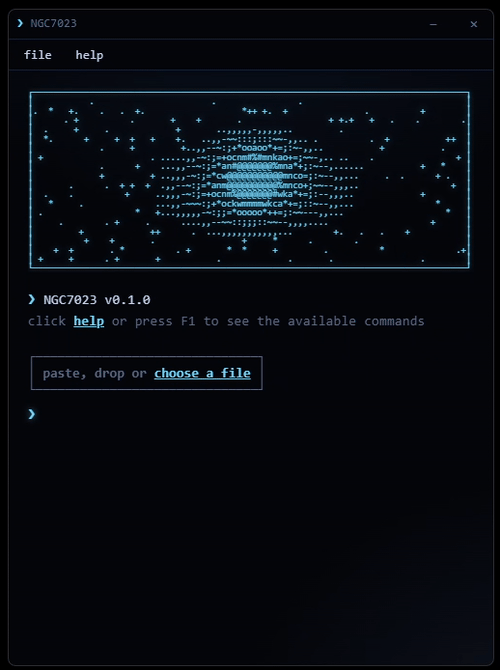
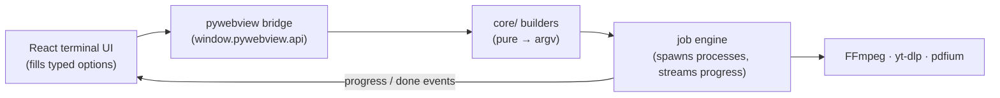

<div align="center">


# NGC7023

A local-first desktop app to **download** videos and audio from the web and
**convert** media, images, PDFs and subtitles, entirely on your own machine.
No account, no cloud, no telemetry.



</div>

---

## Demos

| Download a video | Convert a video to GIF | Themes, fonts & system info |
| :---: | :---: | :---: |
|  |  |  |

</div>

## Overview

NGC7023 is a desktop application with a **terminal-style interface**: you paste a
link or drop a file, answer a few numbered questions, and it runs the job. All the
heavy lifting is done by bundled command-line tools (**yt-dlp** for downloads and
**FFmpeg** for media) orchestrated locally. Nothing is uploaded anywhere.

## Features

### Downloader
- Paste a link from YouTube, X/Twitter, Facebook, Instagram, TikTok, Reddit and
  the many other sites yt-dlp supports.
- Download as **video** (pick a max resolution) or extract **audio** (mp3, opus, …).
- Links are validated up front, so an unsupported or private URL is reported before
  you pick a format.
- Thumbnail and metadata embedded automatically.

### Media converter
- Convert between mp4, mkv, mov, webm, gif, mp3, opus, flac and more.
- **Detailed editing** per file: resolution, frame rate, crop, trim and playback
  speed (slow-motion included).
- **Hardware-accelerated encoding** detected per GPU vendor with a software fallback: AMD (AMF / VAAPI),
  NVIDIA (NVENC), Intel (QSV).

### PDF tools
- Image(s) → PDF (one page per image, sized to the image).
- Merge several PDFs into one.
- Extract or delete pages.
- PDF → images (one file per page).

### Subtitles
- **Soft embed** a selectable subtitle track, or **burn-in** (hardsub) directly
  into the picture.
- Re-sync out-of-time subtitles with a simple +/− delay.
- Burn-in uses your selected GPU encoder, so it isn't forced onto the CPU.

### Cover → video
- Turn a still cover image + an audio file into an upload-ready video (square or
  widescreen, optional blurred background, lossless audio passthrough, optional
  loudness normalization).

### Quality-of-life
- Three languages with automatic detection: **Portuguese, English, Spanish**.
- Themes and adjustable font size.
- System-tray support and optional start-with-Windows.
- Built-in update check against GitHub releases.
- A settings window for defaults (default output folder, animations, tray, …).

## Install

Download the latest build from the
[**Releases**](https://github.com/viwctor/NGC7023/releases/latest) page and run it.
FFmpeg and yt-dlp come bundled, so there's nothing else to install.

- **Windows**: the `ngc7023_setup_windows.exe` installer (per-user, no admin needed).
- **Linux**: the `ngc7023_x86-64_linux.AppImage` (`chmod +x`, then run).

Prefer to build it yourself? See [Run from source](#run-from-source).

## Run from source

Requirements: **Python 3.11+** and **Node.js 18+**.

```bash
# 1. Frontend (run inside ./frontend): outputs into ../ngc7023/web
cd frontend
npm install
npm run build          # REQUIRED before launching: the app loads ngc7023/web/index.html
cd ..

# 2. Python environment
python -m venv .venv
.venv\Scripts\activate         # Windows  (use: source .venv/bin/activate on Linux)
pip install -e .

# 3. Sidecar binaries (not in git): drop ffmpeg and yt-dlp
#    (plain names, .exe on Windows) into ./binaries/

# 4. Launch
python -m ngc7023
```

Environment variables: `NGC_DEBUG=1` opens the webview devtools;
`NGC_DEV_URL=http://localhost:7023` loads a live Vite dev server instead of the
built files.

### Tests

```bash
python -m pytest -q
```

The suite is pure and runs anywhere; the integration tests spawn real FFmpeg and
auto-skip if no FFmpeg binary is found.

## How it works

The single most important convention: **the UI never builds a command string.** It
fills a typed options object, and a pure builder turns that into the exact argument
vector for FFmpeg / yt-dlp. This keeps the "no typing commands" promise and isolates
portable logic from platform glue.



| Layer | Technology |
| --- | --- |
| Shell | Python + [pywebview](https://pywebview.flowrl.com) (WebView2 on Windows, WebKitGTK on Linux) |
| Frontend | React 19, TypeScript, Vite (terminal UI) |
| Downloads | [yt-dlp](https://github.com/yt-dlp/yt-dlp) |
| Media | [FFmpeg](https://ffmpeg.org) |
| PDF | [pypdf](https://github.com/py-pdf/pypdf) (pages), [pypdfium2](https://github.com/pypdfium2-team/pypdfium2) (rasterize), [Pillow](https://python-pillow.org) (image → PDF) |
| Packaging | PyInstaller → Inno Setup (Windows) / AppImage (Linux) |

## Roadmap

- [x] Packaged installers for Windows and Linux
- [x] Auto-update download (not just notification)
- [x] More subtitle conveniences

## License

Released under the [MIT License](LICENSE).

Developed with [Claude Code](https://claude.com/claude-code) by
[viwctor](https://github.com/viwctor).
